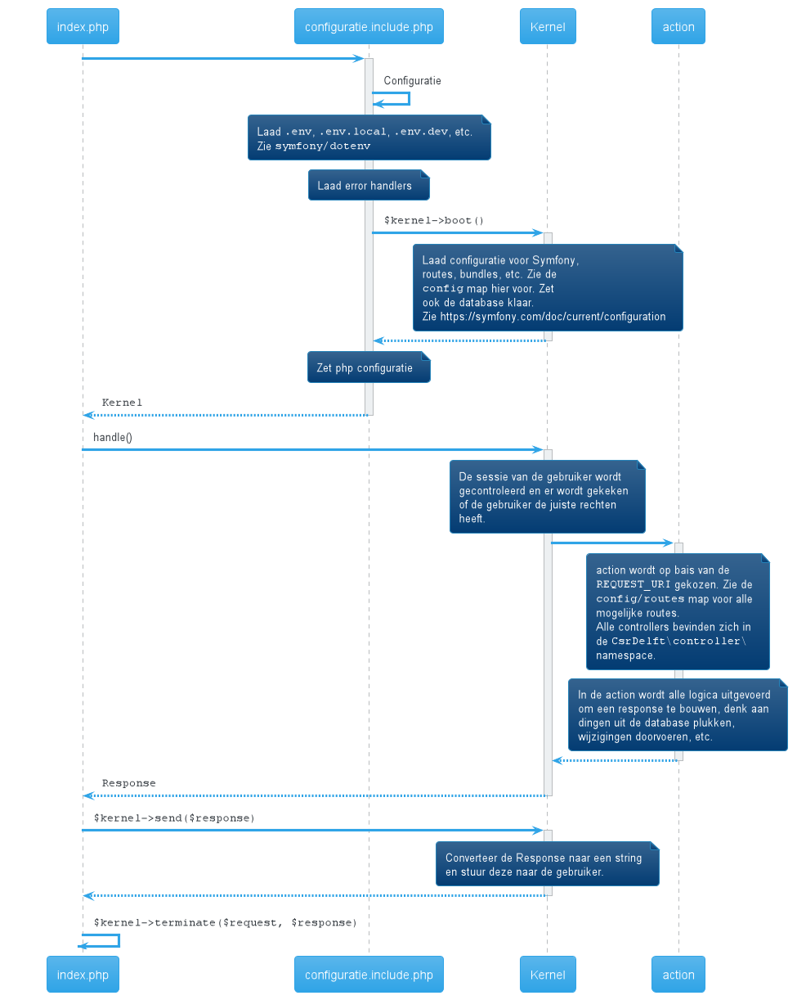

# Request

Dit document beschrijft een standaard request naar de stek. Het volgende diagram beschrijft alle standaard stappen.



Het bestand `htdocs/index.php` is het aanspreekpunt van de stek en bevat drie stappen. Deze stappen zijn hier onder beschreven.

## Setup

De setup van een request is voor iedere request hetzelfde. Bij de setup wordt alles klaar gezet voor Symfony en wordt gecontroleerd met wat voor gebruiker we te maken hebben. Veel van dit proces wordt gecached, waardoor het vlug kan gebeuren.

De bootstrap stap wordt gedaan in `lib/configuratie.include.php` en `config/bootstrap.php` en er is hier meer info over te vinden door de documentatie van [symfony/dotenv](https://symfony.com/doc/current/components/dotenv.html) te lezen.

Voor deze stap de documentatie van [Symfony](https://symfony.com/doc/current) behulpzaam. De setup van de stek doet alle configuratie met YAML (in Symfony kun je kiezen tussen PHP, XML en YAML).

Het resultaat van deze stap is een `Kernel` object, dit object bevat alle info die nodig is om een request af te handelen. Zoals de [router](../backend/routes.md) en de [service container](../backend/services.md).

## Handle

Het verwerken van een request wordt door een Controller gedaan. Hier komen we in het domein van onze eigen code.
Iedere request komt aan bij een functie in een controller. Welke functie dit precies is kan op twee plekken gedefinieerd zijn.
- De .yaml bestanden in `config/routes` bevatten een aantal routes, zoals de standaard route en de routes voor groepen
- Controllers in de `lib/controller` map bevatten annotaties om routes te matchen.

Om makkelijk te controleren welke route bij een bepaalde pagina hoort kun je in de Symfony Profiler toolbar kijken


Dit kan je ook met de command line doen als je de pagina niet voor je neus hebt bijvoorbeeld.

```bash
php bin/cconsole router:match /forum/onderwerp/123

 [OK] Route "csrdelft_forum_onderwerp" matches

+--------------+--------------------------------------------------------------------------------------------------+
| Property     | Value                                                                                            |
+--------------+--------------------------------------------------------------------------------------------------+
| Route Name   | csrdelft_forum_onderwerp                                                                         |
| Path         | /forum/onderwerp/{draad_id}/{pagina}/{statistiek}                                                |
| Path Regex   | {^/forum/onderwerp/(?P<draad_id>[^/]++)(?:/(?P<pagina>[^/]++)(?:/(?P<statistiek>[^/]++))?)?$}sDu |
| Host         | ANY                                                                                              |
| Host Regex   |                                                                                                  |
| Scheme       | ANY                                                                                              |
| Method       | GET                                                                                              |
| Requirements | NO CUSTOM                                                                                        |
| Class        | Symfony\Component\Routing\Route                                                                  |
| Defaults     | _controller: CsrDelft\controller\ForumController::onderwerp()                                    |
|              | pagina: NULL                                                                                     |
|              | statistiek: NULL                                                                                 |
| Options      | compiler_class: Symfony\Component\Routing\RouteCompiler                                          |
|              | utf8: true                                                                                       |
+--------------+--------------------------------------------------------------------------------------------------+
```

Een controller functie returned een `Response` of een `ToResponse` (uitzondering) die in de volgende stap naar de gebruiker verzonden kan worden. Kijk in [Routes](../backend/routes.md) om te lezen hoe je een nieuwe route toevoegt.

## Send

In deze stap wordt de Response die in de vorige stap geprepareerd is naar de gebruiker verzonden. In deze stap worden ook nog templates gerenderd.
