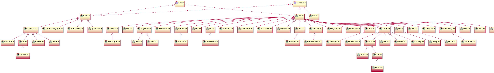

# [WIP!] Formulier

Formulier is een klasse die gebruikt kan worden om formulieren op te bouwen en te valideren. Alle bestanden gerelateerd aan Formulier zijn te vinden in `lib/view/formulier`. Een formulier kan een hele pagina in beslag nemen, in een smarty template voorkomen of als popup gebruikt worden.

## Fields



## Voorbeeld

```PHP
class MijnForm extends Forumulier {
    function __construct(Voorbeeld $model) {
        parent::__construct($model, '/voorbeeld/', false, true);
        $fields[] = new RequiredTextField('voornaam', $model->voornaam, 'Voornaam');
        $fields[] = new TextField('achternaam', $model->voornaam, 'Achternaam');
        $fields[] = new RequiredTextField('verhaal', $model->verhaal, 'Verhaal');
        $fields['btn'] = new FormDefaultKnoppen();

        $this->addFields($fields);
    }
}
```

```PHP
class VoorbeeldController extends Controller {
    ...

    public function voorbeeld() {
        if ($this->isPosted()) {
            $voorbeeld = new Voorbeeld();
            $voorbeeld->voornaam = filter_input(INPUT_POST, 'voornaam', FILTER_SANITIZE_STRING);
            $voorbeeld->achternaam = filter_input(INPUT_POST, 'achternaam', FILTER_SANITIZE_STRING);
            $voorbeeld->verhaal = filter_input(INPUT_POST, 'verhaal', FILTER_SANITIZE_STRING);
            $form = new MijnForm($voorbeeld);
            if ($form->validate()) {
                VoorbeeldModel::instance()->create($voorbeeld);
                setMelding("Voorbeeld met succes aangemaakt", 1);
                $this->view = new MijnForm(new Voorbeeld());
            } else {
                $this->view = $form;
            }
        } else {
            $this->view = new MijnForm(new Voorbeeld());
        }
    }
}
```
